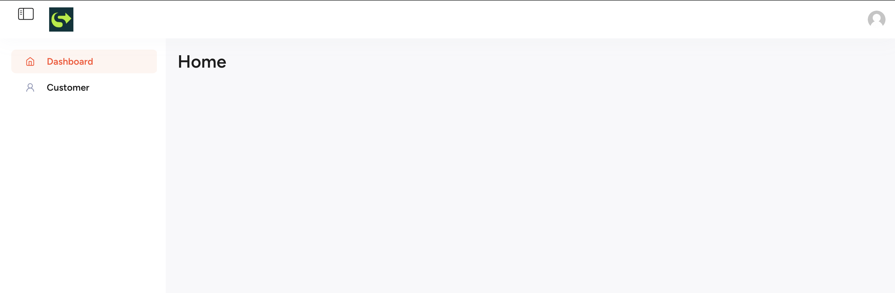
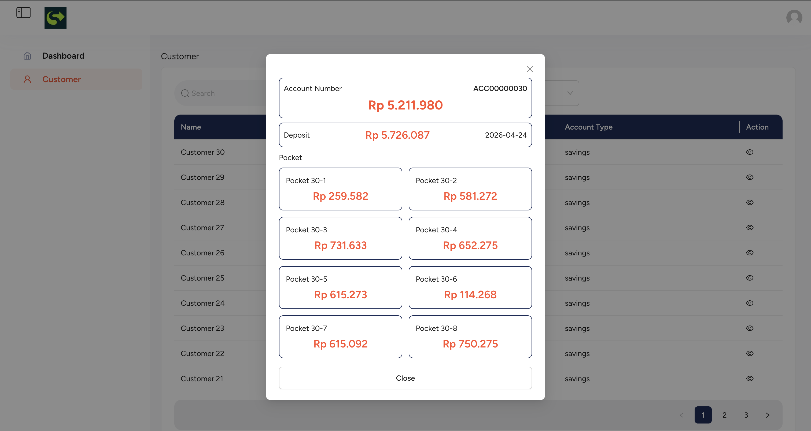

# 🏦 Superbank Dashboard

A simple dashboard application to search customer banking data. Built with:

- **Frontend**: Next.js  
- **Backend**: Golang  
- **Database**: SQLite (easily switchable to PostgreSQL)  
- **Authentication**: JWT
- **Containerization**: Docker  

---

## ✨ Features

- 🔍 Search customers by name or bank account  
- 🏦 View customer accounts, pockets, and term deposits  
- 🔐 JWT-based login  
- 🐳 Docker support for easy setup  

---

## 📁 Project Backend Structure

```
backend-service/         # Go backend service
├── cmd/                 # Main application entry point
├── config/              # Configuration files
├── internal/            # Core business logic
├── migration/           # DB migration scripts
├── pkg/                 # Shared utilities/libraries
├── config.toml          # App config
├── customer_data.db     # SQLite database (sample data)
├── Dockerfile           # Backend Dockerfile
├── go.mod, go.sum       # Go modules
└── Makefile             # Build helper
```

## 📁 Project Frontend Structure

```
dashboard/
├── .next/                  # Compiled output (Next.js build artifacts)
├── node_modules/           # Node dependencies
├── public/                 # Public assets (images, icons, etc.)
├── src/                    # Source directory
│   ├── app/                # Next.js app directory (routing, layout)
│   ├── components/         # Reusable UI components
│   ├── configs/            # Configuration utilities (e.g., API base URLs)
│   ├── enums/              # TypeScript enums
│   ├── features/           # Feature-specific modules (e.g., customers)
│   ├── hooks/              # Custom React hooks
│   ├── providers/          # Context providers (e.g., AuthProvider)
│   ├── store/              # Global state management (Redux/Zustand/etc.)
│   ├── types/              # Global TypeScript types/interfaces
│   ├── utils/              # Utility/helper functions
│   └── middleware.ts       # Next.js middleware (auth guards, etc.)
├── .env.example            # Sample environment variables
├── .gitignore              # Git ignore rules
├── Dockerfile              # Dockerfile for frontend
├── eslint.config.mjs       # ESLint config
├── next-auth.d.ts          # TypeScript declaration for NextAuth
├── next-env.d.ts           # Next.js environment declarations
├── next.config.ts          # Next.js configuration
├── package.json            # NPM dependencies and scripts
├── package-lock.json       # Exact dependency versions
├── postcss.config.mjs      # PostCSS configuration
├── tailwind.config.ts      # Tailwind CSS configuration
├── tsconfig.json           # TypeScript configuration
└── README.md               # Frontend-specific README (optional)
```

---

## 🚀 Getting Started

### 🔧 Prerequisites

- Next 15 or higher
- Go v1.23 or higher
- Docker & Docker Compose


### 1. Run with Docker

```bash
docker-compose up --build
```

- Frontend: `http://localhost:3000`  
- Backend: `http://localhost:4000`

### 3. (Optional) Run Manually Without Docker

#### Backend

```bash
cd backend-service
go run cmd/main.go
```

#### Frontend

```bash
cd dashboard
npm install
npm run dev
```

---

## 🔐 Authentication

JWT-based authentication is available (optional). To use:

1. Login to get a token.
2. Send token using header:  
   `Authorization: Bearer <your-token>`  
3. Access protected endpoints.

---
### 🧪 Test Credentials

You can use the following credentials to log in as an admin user:

- **Email**: `admin@admin.com`  
- **Password**: `Admin@123`

---

## 🖼️ Screenshots

1. **Login Page**

2. **Register Page**

3. **Dashboard**

4. **Customer** 

5. **Customer Detail** 


---

## 📆 Project Decisions

- Chose SQLite for simplicity. Can easily be replaced by PostgreSQL.
- Separated frontend and backend for better scalability and maintainability.
- Optional features like JWT authentication included for better security and reliability.
- Docker is used for consistent development and deployment environment.

---

## 📬 Submission Checklist

- ✅ Public GitHub repository  
- ✅ README file with setup instructions and decisions  
- ✅ Screenshots included  
- ✅ Bonus: JWT authentication, Dockerized services  

